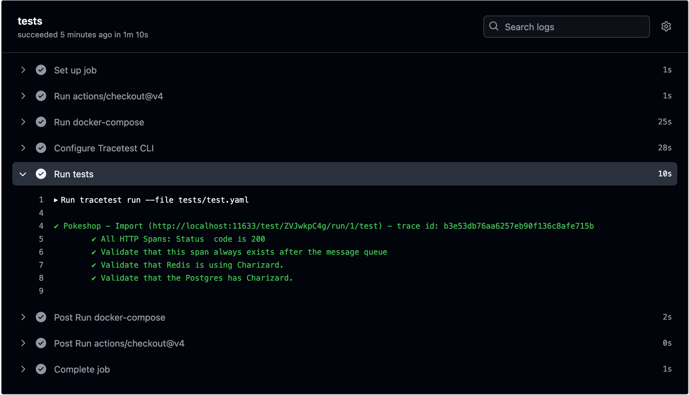

## tracetest-example

This is the [quick-start-pokeshop](https://github.com/kubeshop/tracetest/tree/main/examples/quick-start-pokeshop)
example, automated with Github Actions.

The workflow is defined in [`.github/workflows/tracetest.yml`](.github/workflows/tracetest.yml).

A successful run looks like this:

Happy testing! 🚀
